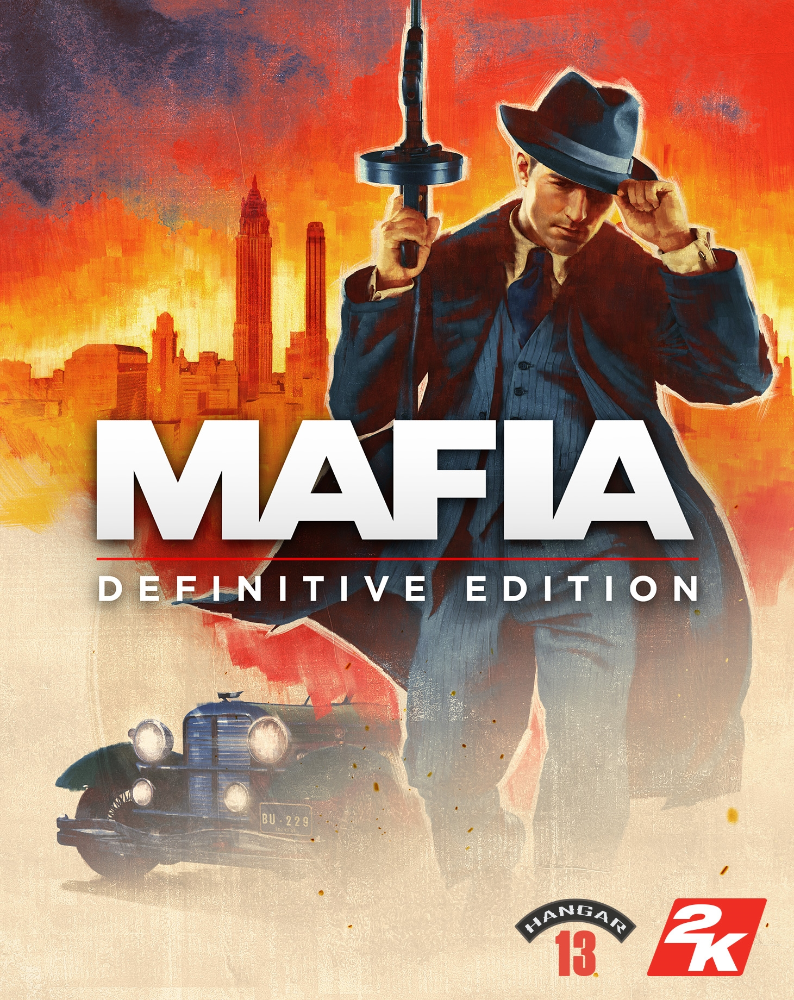

# Script

###### Intro
Ladies and Gentlemen my name is Rustyboy and welcome to my video on Mafia Definitive Edition brought to you by Hangar 13.  Other titles they have been responsible for include Mafia II Definitive Edition and Mafia III.

###### Game Modes

1. Missions
    - Linear Missions
2. Free Ride
    - Can be accessed after completing the first mission
    - Challenges are unlocked once completing the first mission (The Crazy Horse)
3. Test Drive

###### Settings

[Optimal Graphics Settings](https://github.com/Rustyb0y/youtube/tree/master/mafia_de/graphics)

###### Bugs
- Minor voice inconsistencies
- Characters can get stuck into the environment if they use scripted movement
- People on the street flying through the air when driving near them

###### Difficulty
- I played the game on Classic (Hardest Difficulty)
- Driving was all done with keyboard

###### Overview
- Immersive Storytelling
- Very minor bugs
- Highly Recommended
- Thoroughly Enjoyable

## Story Missions

V1 0:03:54 Prologue 1938 6m

### 1930 (1hr 22m)
- V1 0:10:25 An offer you can't refuse 10m
- V1 0:20:16 Running Man 13m
- V1 0:33:07 Molotov Party 25m
- V1 0:58:24 Ordinary Routine 30m
- V1 1:28:00 Intermezzo 1938 4m

### 1932 (4hrs 19m)
- V1 1:31:54 Fair Play (Racing) 80m
- V1 2:51:25 Sarah 90m
- V1 3:04:28 Better get used to it 16m
- V1 3:23:05 The Saint and the Sinner 67m
- V1 4:30:37 Intermezzo 1938 6m

### 1933 (2hrs 19m)
- V1 4:35:43 A trip to the Country 54m
- V2 0:00:00 Omerta 36m
- V2 0:36:05 Visiting Rich People 24m
- V2 0:59:24 Great Deal 20m

V2 1:19:53 Intermezzo (Missing Footage) ~5m

### 1935 (1hr 48m)
- V2 1:19:53 Bon Apetite (Attempting Killing) 17m
- V3 0:00:00 Happy Birthday (Revenge Killing) 24m
- V4 0:23:43 You Lucky Bastard 42m
- V4 1:06:07 Creme de La creme 20m
- V4 1:26:36 Intermezzo 5m

### 1938 (2hr 30m)
- V4 1:30:45 The Election Intro Only (Assassination) 3m
- V5 0:00:00 The Election (Assassination) 46m
- V5 0:45:48 Just for Relaxation (Customs Robbery) 49m
- V5 1:34:14 Moonlighting (Bank Job w/Paulie) 15m
- V5 1:48:29 The Death of Art (Sam's Betrayal) 31m

V5 2:20:40 Epilogue Finale 1951 6m

### Total Time: 12hrs 24m

V5 2:26:40 Credits

## Free Ride

### 12 Challenges
1. Little Italy, West - Telephone (The Crazy Horse)
2. Works Quarter, Trolley Station (Look at the Sky at Night) - ?
3. Oakwood, East of Graveyard
4. Central Island, Parking Garage
5. Chinatown - Disused Service Station
6. Lost Heaven Harbour, Entrance - Telephone
7. Frye Dam, Power Station
8. Downtown, West - Giant Cup
9. Pepe's Telephone
10. Holbrook, North East - Bessy
11. Holbrook, South - Telephone (Carlo Murder)
12. 

## Test Drive

# Tips

###### General
- Use timing to destroy barrels inorder to kill enemies

###### Fair Play
- Use the high points on the banked curves to maintain speed
- Better to lose track position than to risk crashing
- Try and gain positions early using the braking zones and corners
- Cars will randomly crash during the race

# Resources
- [PCGamingWiki](https://www.pcgamingwiki.com/wiki/Mafia:_Definitive_Edition)
- [Graphics Settings Guide by WePC](https://www.youtube.com/watch?v=TWZj4zSw2vw)
- [Fandom.com MafiaWiki](https://mafiagame.fandom.com/wiki/Category:Mafia:_Definitive_Edition)

# Useful Links
- [Skip Launcher - PCGamingWiki](https://www.pcgamingwiki.com/wiki/Mafia:_Definitive_Edition#Skip_2K_launcher)
- [Skip Intro - PCGamingWiki](https://www.pcgamingwiki.com/wiki/Mafia:_Definitive_Edition#Skip_intro_videos)
- [Extended Mouse Buttons - PCGamingWiki](https://www.pcgamingwiki.com/wiki/Mafia:_Definitive_Edition#Map_Extended_Mouse_Buttons)
- [Enable Refresh Rate - PCGamingWiki](https://www.pcgamingwiki.com/wiki/Mafia:_Definitive_Edition#Run_the_game_at_screen_refresh_rate_in_fullscreen)
