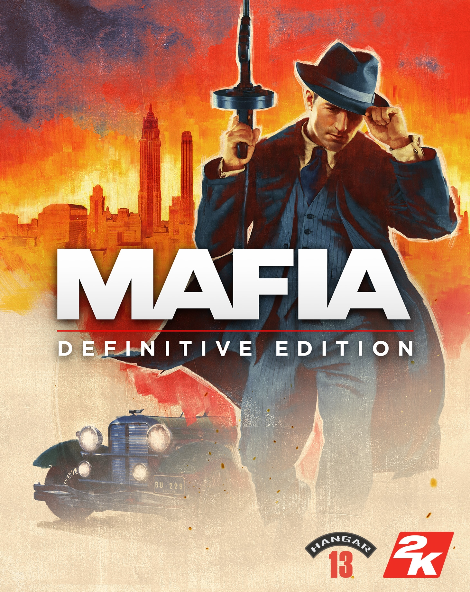

# Script

## Intro

## Settings

## Graphics Optimisation

## Difficulty

# Game Modes

## Missions

0:03:54 Intro 1938 6m

###### 1930
- V1 0:10:25 An offer you can't refuse 10m
- V1 0:20:16 Running Man 13m
- V1 0:33:07 Molotov Party 25m
- V1 0:58:24 Ordinary Routine 30m

V1 1:28:00 Intermezzo 1938 4m

88m

###### 1932
- V1 1:31:54 Fair Play (Racing) 80m
- V1 2:51:25 Sarah 90m
- V1 3:04:28 Better get used to it 16m
- V1 3:23:05 The Saint and the Sinner 67m

V1 4:30:37 Intermezzo 1938 6m

259m

###### 1933
- V1 4:35:43 A trip to the Country 54m
- V2 0:00:00 Omerta 36m
- V2 0:36:05 Visiting Rich People 24m
- V2 0:59:24 Great Deal 20m

V2 1:19:53 Intermezzo (Missing Footage) ~5m

139m

###### 1935
- V2 1:19:53 Bon Apetite (Attempting Killing) 17m
- V3 0:00:00 Happy Birthday (Revenge Killing) 24m
- V4 0:23:43 You Lucky Bastard 42m
- V4 1:06:07 Creme de La creme 20m

V4 1:26:36 Intermezzo 5m

108m

###### 1938
- V4 1:30:45 The Election Intro Only (Assassination) 3m
- V5 0:00:00 The Election (Assassination) 46m
- V5 0:45:48 Just for Relaxation (Customs Robbery) 49m
- V5 1:34:14 Moonlighting (Bank Job w/Paulie) 15m
- V5 1:48:29 The Death of Art (Sam's Betrayal) 31m

V5 2:20:40 Intermezzo Finale 1951 6m

150m

744m = 12 Hours 24m

V5 2:26:40 Credits

## Free Ride
- 12 Challenges

1. Little Italy, West - Telephone (The Crazy Horse)
2. Works Quarter, Trolley Station (Look at the Sky at Night) - ?
3. Oakwood, East of Graveyard
4. Central Island, Parking Garage
5. Chinatown - Disused Service Station
6. Lost Heaven Harbour, Entrance - Telephone
7. Frye Dam, Power Station
8. Downtown, West - Giant Cup
9. Pepe's Telephone
10. Holbrook, North East - Bessy
11. Holbrook, South - Telephone (Carlo Murder)

## Test Drive

# Tips
- (General) Use timing to destroy barrels inorder to kill enemies
- (Fair Play) Use the high points on the banked curves to maintain speed
- (Fair Play) Better to lose track position than to risk crashing
- (Fair Play) Try and gain positions early using the braking zones and corners

# Bugs

- V1 3:20:07 Guy flying through the air
- V4 0:13:34 Guy stuck in bannister

# Resources
- [PCGamingWiki](https://www.pcgamingwiki.com/wiki/Mafia:_Definitive_Edition)
- [Graphics Settings Guide by WePC](https://www.youtube.com/watch?v=TWZj4zSw2vw)
- [Fandom.com MafiaWiki](https://mafiagame.fandom.com/wiki/Category:Mafia:_Definitive_Edition)

# Useful Links
- [Skip Launcher - PCGamingWiki](https://www.pcgamingwiki.com/wiki/Mafia:_Definitive_Edition#Skip_2K_launcher)
- [Skip Intro - PCGamingWiki](https://www.pcgamingwiki.com/wiki/Mafia:_Definitive_Edition#Skip_intro_videos)
- [Extended Mouse Buttons - PCGamingWiki](https://www.pcgamingwiki.com/wiki/Mafia:_Definitive_Edition#Map_Extended_Mouse_Buttons)
- [Enable Refresh Rate - PCGamingWiki](https://www.pcgamingwiki.com/wiki/Mafia:_Definitive_Edition#Run_the_game_at_screen_refresh_rate_in_fullscreen)
