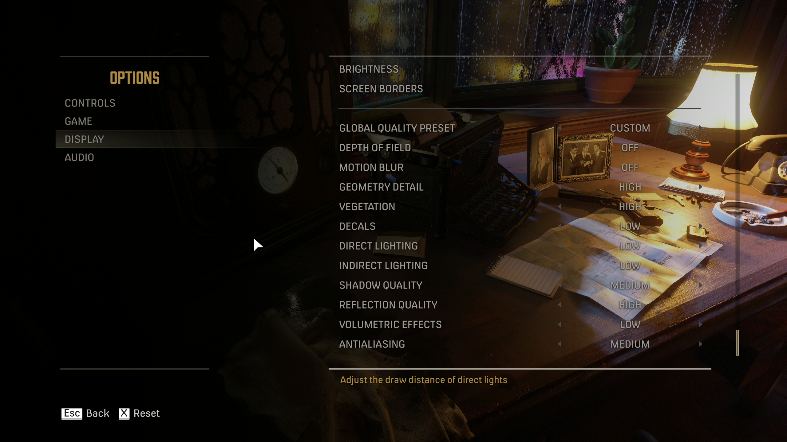

# Mafia Definitive Edition

## Missions
- 0:00:00 An offer you can't refuse
- -:--:-- Running Man
- 0:33:00 Molotov Party
- 0:58:00 Ordinary Routine
1:28:00 Intermezzo 
- 1:32:00 Fair Play
- 2:57:00 Sarah
- 3:04:00 Better get used to it 1932
- -:--:-- The Saint and the Sinner
4:30:50 Intermezzo
- 4:35:00 A trip to the Country
- 0:00:00 Omerta 1933
- 0:36:00 Visiting Rich People 1933
- -:--:-- Great Deal 1933
1:19:00 Intermezzo (Missing Footage)
- 1:19:00 Bon Apetite 1935
- 0:00:00 Happy Birthday 1935
- -:--:-- You Lucky Bastard 1935
- 1:06:00 Creme de La creme 1935
-:--:-- Intermezzo
- -:--:-- The Election 1938

## Notes

###### B-Roll

- Intro: Video 1 3:54 to 6:51 

## Optimal Graphics Settings

###### Highest Performance Impact
- Resolution
- Shadow Quality: MEDIUM
- Antialiasing: MEDIUM

###### Other Settings
- Depth of Field: OFF
- Motion Blur: OFF
- Geometry Detail: MEDIUM+
- Vegetation: MEDIUM+
- Decals: LOW
- Direct Lighting: LOW
- Indirect Lighting: LOW
- Shadow Quality: MEDIUM
- Reflection Quality: MEDIUM+
- Volumetric Effects: LOW
- Antialiasing: MEDIUM

## Useful Links
- [Good graphics settings guide - WePC](https://www.youtube.com/watch?v=TWZj4zSw2vw)
- [Skip Launcher - PCGamingWiki](https://www.pcgamingwiki.com/wiki/Mafia:_Definitive_Edition#Skip_2K_launcher)
- [Skip Intro - PCGamingWiki](https://www.pcgamingwiki.com/wiki/Mafia:_Definitive_Edition#Skip_intro_videos)
- [Extended Mouse Buttons - PCGamingWiki](https://www.pcgamingwiki.com/wiki/Mafia:_Definitive_Edition#Map_Extended_Mouse_Buttons)
- [Enable Refresh Rate - PCGamingWiki](https://www.pcgamingwiki.com/wiki/Mafia:_Definitive_Edition#Run_the_game_at_screen_refresh_rate_in_fullscreen)
