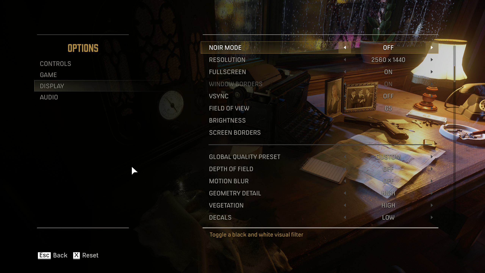
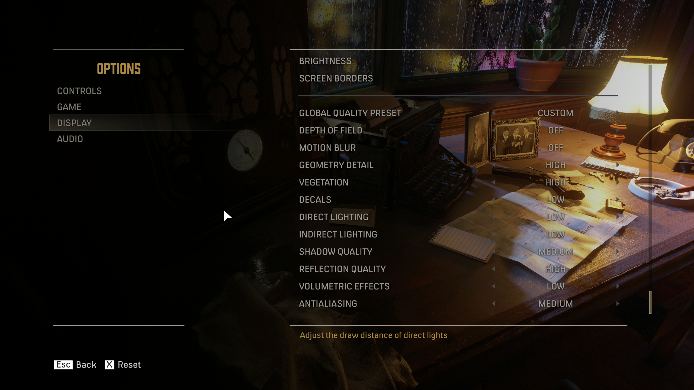

# Optimal Graphics Settings

## Highest Performance Impact
- Resolution
- Shadow Quality: MEDIUM
- Antialiasing: MEDIUM

## Other Settings
- Depth of Field: OFF
- Motion Blur: OFF
- Geometry Detail: MEDIUM+
- Vegetation: MEDIUM+
- Decals: LOW
- Direct Lighting: LOW
- Indirect Lighting: LOW
- Shadow Quality: MEDIUM
- Reflection Quality: MEDIUM+
- Volumetric Effects: LOW
- Antialiasing: MEDIUM

