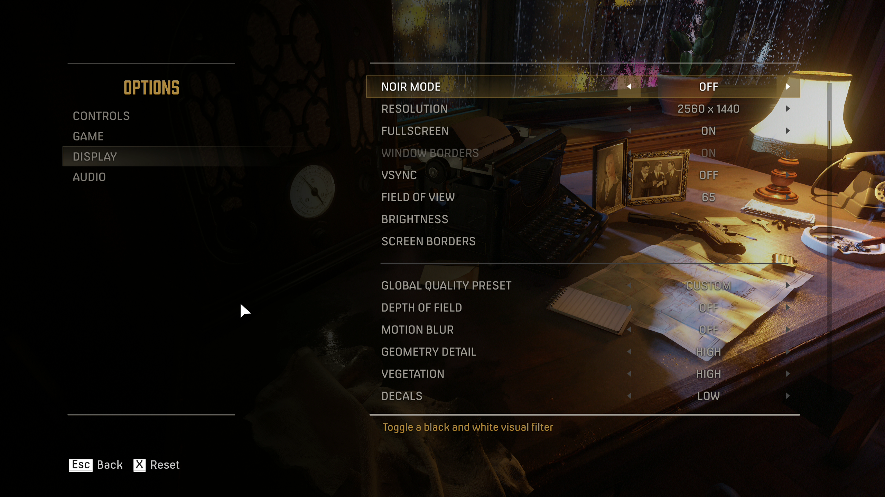

# Mafia Definitive Edition

## Optimal Graphics Settings

###### Highest Performance Impact
- Resolution
- Shadow Quality: MEDIUM
- Antialiasing: MEDIUM

###### Other Settings
- Depth of Field: OFF
- Motion Blur: OFF
- Geometry Detail: MEDIUM+
- Vegetation: MEDIUM+
- Decals: LOW
- Direct Lighting: LOW
- Indirect Lighting: LOW
- Shadow Quality: MEDIUM
- Reflection Quality: MEDIUM+
- Volumetric Effects: LOW
- Antialiasing: MEDIUM

## Useful Links
- [Good graphics settings guide - WePC](https://www.youtube.com/watch?v=TWZj4zSw2vw)
- [Skip Launcher - PCGamingWiki](https://www.pcgamingwiki.com/wiki/Mafia:_Definitive_Edition#Skip_2K_launcher)
- [Skip Intro - PCGamingWiki](https://www.pcgamingwiki.com/wiki/Mafia:_Definitive_Edition#Skip_intro_videos)
- [Extended Mouse Buttons - PCGamingWiki](https://www.pcgamingwiki.com/wiki/Mafia:_Definitive_Edition#Map_Extended_Mouse_Buttons)
- [Enable Refresh Rate - PCGamingWiki](https://www.pcgamingwiki.com/wiki/Mafia:_Definitive_Edition#Run_the_game_at_screen_refresh_rate_in_fullscreen)
